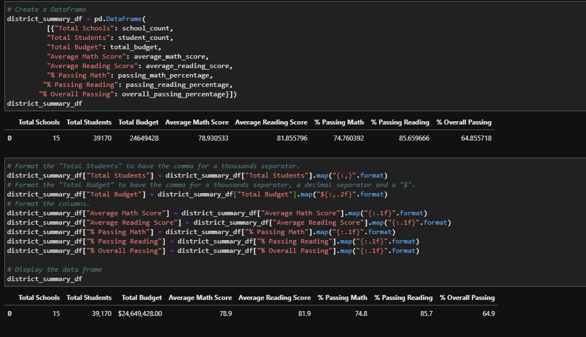
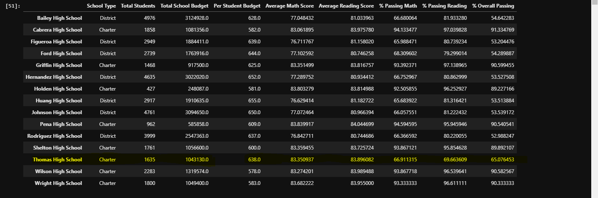
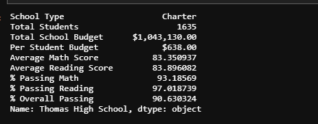
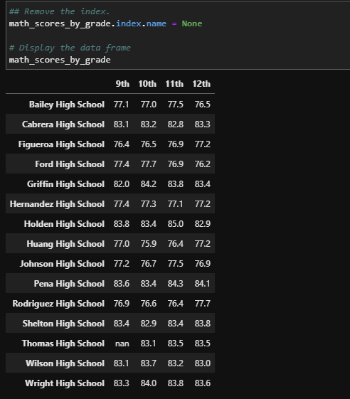
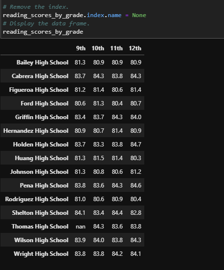
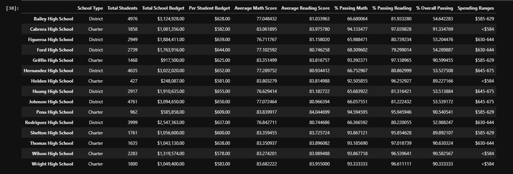
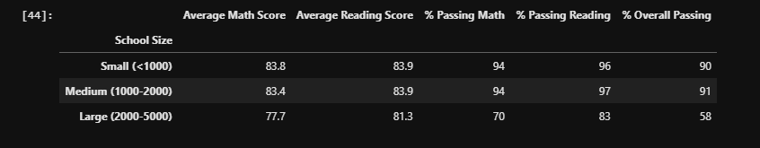
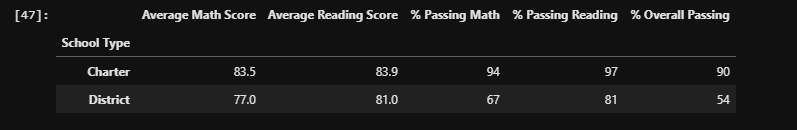

# School_District_Analysis

## Project Overview

The Client is the Chief Data scientist at the City School District, the client asked for a second analysis after finding evidence of academic dishonesty. The data was aggregated to showcase trends and school performance and in assisting the school board and superintendent in making decisions at the school and district level.

### Purpose

The purpose of this project was to generate a district wide summary showing analysis of:

District Summary
School Summary
High and Low Performing Schools
Math & Reading Scores by Grade
Scores by School Spending
Scores by School Size
Scores by School Type
69+857471
83+9..

## Results

#### How is the district summary affected?
After the analysis, the district summary was not affected by much as the scores almost stayed the same with minor point difference.

 

#### How is the school summary affected?

By adding the precentage column for match, reading & overall the result change for Thomas High school and it was now in top 5.

#### How does replacing the ninth graders’ math and reading scores affect Thomas High School’s performance relative to the other schools?
Overall Thomas High school performaning in Top 5 school it's becuse we dont have all the data from that school.

#### How does replacing the ninth-grade scores affect the following:

As we added the NAN in the Math & reading scores for ninth grade for Thomas High School, it's affecting the analysis  for Math & reading analysis

•	Math and reading scores by grade.

•	Scores by school spending

The scores by school spending did not change at all. 

•	Scores by school size

The scores by school size did not change at all. 

•	Scores by school type

The scores by school type did not change at all.

## Summary

There were changes in the updated school district analysis after reading and math scores for the ninth grade at Thomas High School have been replaced with NaNs.

The district experienced a .3 percentage point decrease in percent of students passing reading.
The district saw a .2 percentage point decrease in percent of students passing math.
The 9th grade scores in the school data are now NaNs.
Charter schools score higher in reading, math, and overall passing precentage.
Large schools have the lowest Overall Passing precentage when compared to small and medium schools.
